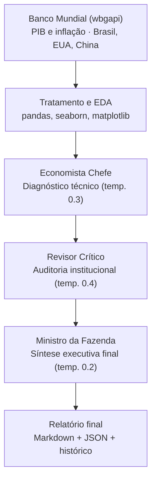

[README.md](https://github.com/user-attachments/files/30610270/README.md)
# 🏛️ Comitê Multiagente: Debate Estrutural da Economia Brasileira

Sistema que utiliza Inteligência Artificial como motor de raciocínio crítico em cadeia para simular um comitê de política econômica. O pipeline analisa dados macroeconômicos reais do Brasil usando potências globais apenas como contexto exógeno para produzir recomendações de política pública viáveis, tanto tecnicamente quanto politicamente.

> 🔰 **Este é o v1 do projeto  publicado deliberadamente simples.** O plano de evolução está documentado abaixo, no Roadmap. Ideias e sugestões são bem-vindas.

---

## 🎯 O Problema

Ferramentas de IA generativa costumam responder perguntas econômicas com um único ponto de vista geralmente o mais "tecnicamente correto", mas alheio à viabilidade política e social de aplicá-lo. Um economista ortodoxo sozinho recomendaria corte de gastos; sem um contraponto institucional, essa recomendação nunca sobreviveria ao Congresso.

Este projeto testa uma hipótese: **um debate estruturado entre agentes de IA com personas e temperaturas diferentes produz uma recomendação final mais equilibrada do que uma única chamada de modelo.**

## 💡 Visão e Viés do Sistema

O projeto foi desenhado com um viés **intencional e declarado 100% pró-Brasil**:

- **O núcleo:** os dados de PIB e inflação brasileiros são o centro de toda a análise.
- **Variáveis exógenas:** EUA e China não são modelos a serem copiados. Eles entram no sistema exclusivamente como fontes de choques externos (ex: juros americanos pressionando câmbio, desaceleração chinesa afetando exportações).
- **Critério de sucesso:** as recomendações finais convergem unicamente para o que melhora o cenário interno brasileiro.

## ⚙️ Arquitetura do Pipeline



O fluxo integra Engenharia de Dados (ETL), Análise Exploratória e orquestração de agentes autônomos:

1. **Extração (ETL):** coleta automatizada via API do Banco Mundial (`wbgapi`) para os últimos 10 anos, com transformação estrutural usando `pandas` (indicadores `NY.GDP.MKTP.KD.ZG` e `FP.CPI.TOTL.ZG`, para Brasil, EUA e China).
2. **Visualização (EDA):** painéis comparativos das trajetórias macroeconômicas com `seaborn` e `matplotlib`.
3. **Debate multiagente (Google Gemini):**
   - 📊 **Economista Chefe** — diagnóstico quantitativo e pragmático, focado no mercado interno.
   - 🏛️ **Revisor Crítico** — audita a viabilidade política e institucional, aponta reações do Congresso, rigidez fiscal e efeitos colaterais.
   - 🔨 **Ministro da Fazenda** — árbitro final, entrega a síntese executiva equilibrando técnica e realidade política.
4. **Governança de dados:** rastreabilidade completa com salvamento de cada execução em `.md` e `.json`, e monitoramento analítico do volume argumentativo dos agentes ao longo do tempo.

## 🧠 Decisões de Engenharia

- **Temperature calibrada por papel, não fixa no pipeline inteiro.** O Economista Chefe roda em `0.3` (rigor analítico), o Revisor Crítico em `0.4` (mais liberdade para contra-argumentar) e o Ministro em `0.2` (decisão final precisa ser estável e determinística, não "criativa").
- **Chamadas stateless entre agentes.** Cada agente recebe apenas o texto de saída do anterior via prompt e não há histórico de conversa acumulado, o que torna cada etapa auditável e substituível isoladamente.
- **Separação entre lógica de dados e lógica de exibição.** `rodar_pipeline_multiagente()` devolve um dicionário puro (`economista`, `critico`, `sintese`); a formatação em Markdown para exibição é uma camada à parte, facilitando reaproveitar o pipeline em outro contexto (script `.py`, API, dashboard).
- **Migração de SDK em produção.** O projeto começou com `google-generativeai` (deprecado) e foi migrado para o novo `google-genai`, atualizando também o modelo para `gemini-3.5-flash`.
- **Histórico versionado, não só o último resultado.** Cada execução salva `.md` (leitura humana) e `.json` (metadados + reprocessamento programático), permitindo montar um gráfico comparando o "tamanho argumentativo" de cada agente ao longo de múltiplas execuções.

## 🚀 Stack Tecnológico

- **Core:** Python
- **Dados & Analytics:** pandas, matplotlib, seaborn, wbgapi
- **IA & Orquestração:** google-genai (Gemini)

## 💻 Como Executar

1. Clone o repositório e abra o arquivo `multi_agent_debate.ipynb` (Google Colab ou Jupyter).
2. Instale as dependências:
   ```bash
   pip install wbgapi pandas google-genai matplotlib seaborn
   ```
3. Configure sua API Key do Google AI Studio (`GEMINI_API_KEY`):
   - **No Colab:** utilize o gerenciador de *Secrets* (ícone 🔑).
   - **Localmente:** o script solicitará a inserção da chave de forma segura no terminal.
4. Execute as células em ordem para rodar o pipeline automatizado.

## 🗺️ Roadmap

O plano de evolução deste projeto é público e intencional cada versão será documentada em um novo post.

| Versão | Status | O que inclui |
|---|---|---|
| **v1** | ✅ Este repositório | 3 agentes em cadeia (Economista → Crítico → Ministro), dados de PIB e Inflação (Brasil, EUA, China), relatório final + histórico de execuções |
| **v2** | 🔜 Próximo post | Novos dados via Banco Mundial e Banco Central (Câmbio, Desemprego, Selic, Dívida Pública/PIB) e um teste de robustez: injetar um dado incoerente na tabela e medir se o Revisor Crítico detecta a inconsistência |
| **v3** | 🔭 Pesquisa futura | Agente extra de Red Team (tenta derrubar a decisão final), backtesting histórico (comparar recomendação passada com o que realmente aconteceu) e um score de consenso entre os agentes, plotável ao longo do tempo |
| **v4** | ⚖️ Teste de Integridade | **Estresse de persona (economia comportamental):** injetar no prompt do Ministro dilemas éticos, pressão de reeleição ou crises financeiras pessoais fictícias, e medir o quanto a decisão final se desvia da recomendação racional-base, um teste de o agente manter a racionalidade de Estado ou ceder à corrupção |

## 🔭 Próximos Passos

Esta é a v1, publicada deliberadamente simples o começo de um projeto, não o teto dele.

O próximo passo (v2) é expandir os dados Câmbio, Desemprego, Selic e Dívida Pública/PIB e testar a robustez do sistema: plantar de propósito um dado incoerente na tabela e medir se o Revisor Crítico percebe a inconsistência. Depois disso, o plano fica mais ambicioso: um agente de Red Team que tenta derrubar a decisão final do Ministro (v3), e um teste de estresse de persona, para ver se o modelo mantém a racionalidade de Estado sob pressão política ou cede à corrupção (v4).

Esse projeto está sendo construído em público, um passo de cada vez. Sugestões, críticas e ideias são muito bem-vindas.

## 📌 Status

Projeto pessoal, em evolução ativa e construído em público.
